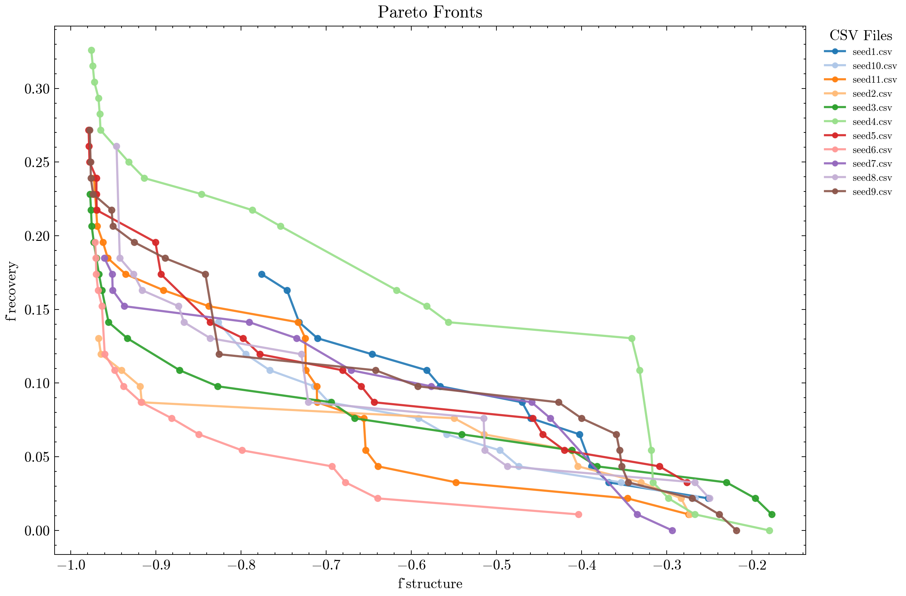
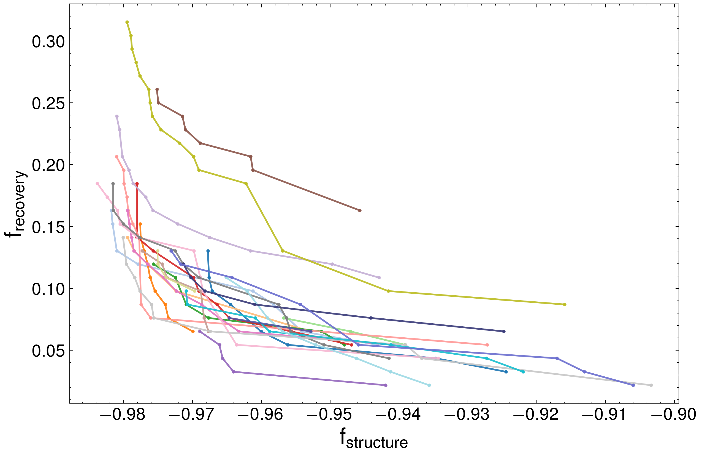
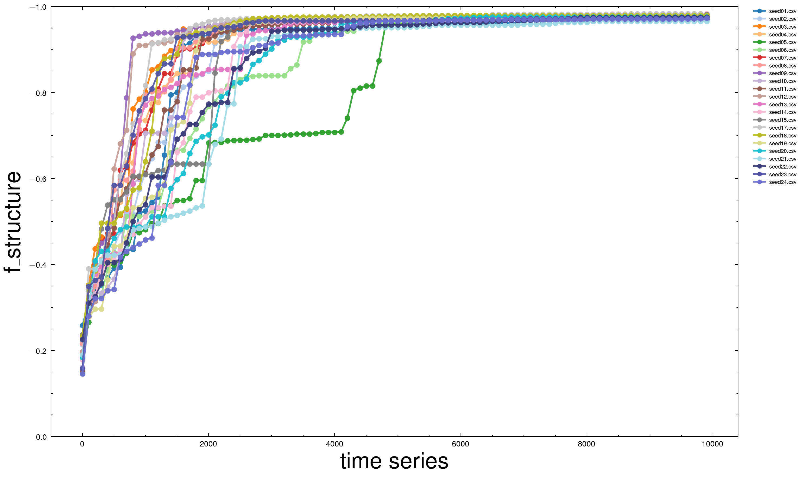
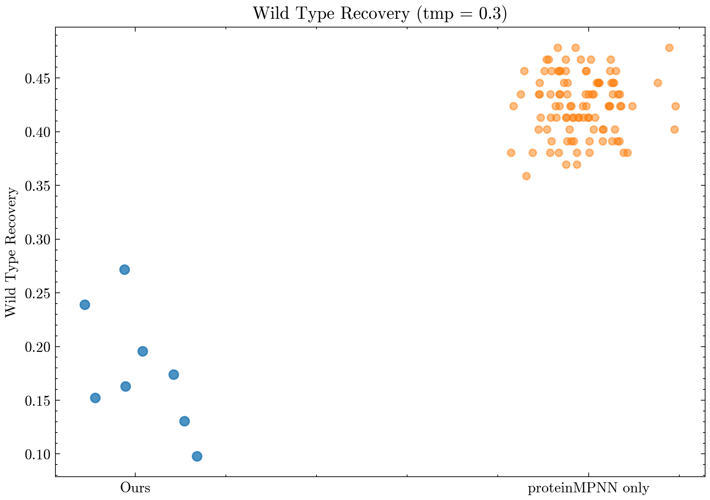
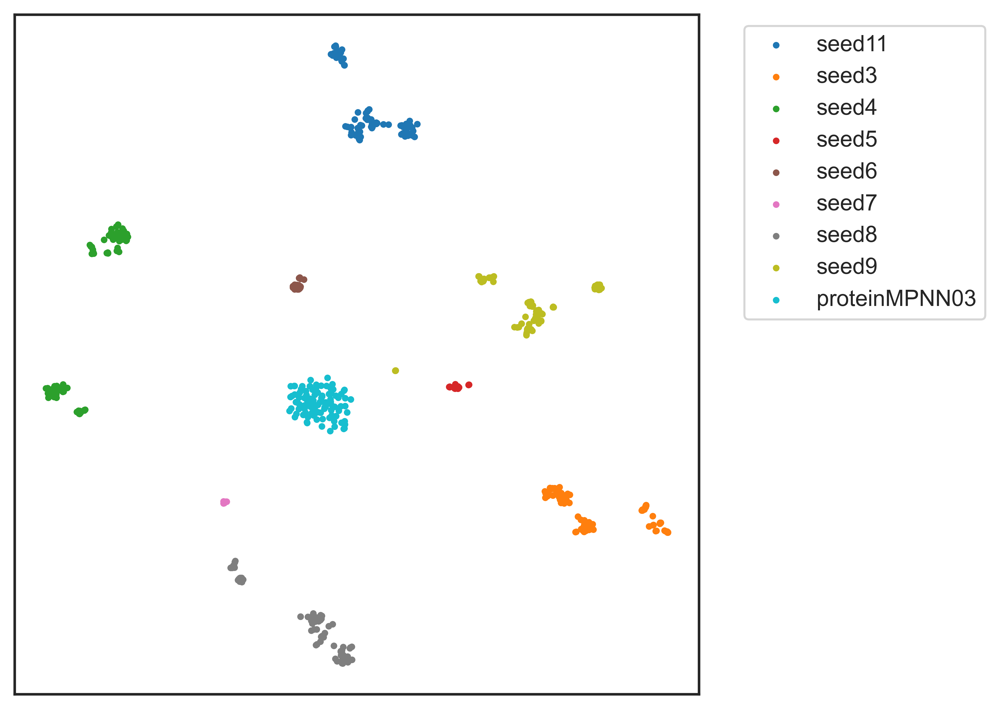
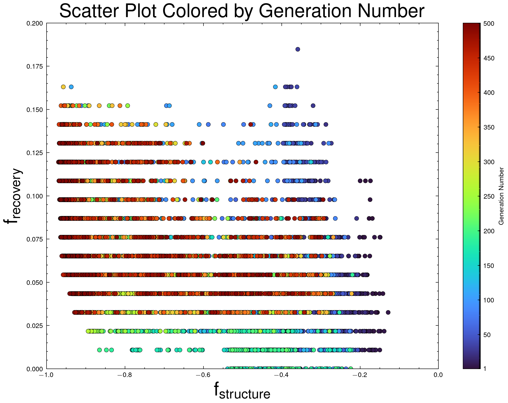

実験するためのコード 

main.py 

依存関係 

plotのためのコード 

~~~shell 
python plot-code/Distribution_map.py
~~~

---
 

~~~shell 
python plot-code/fillter_Distribution_map.py
~~~

---
 

~~~shell
python plot-code/TM-scorePlot.py
~~~

---
 

~~~shell
python plot-code/wtr_strip.py
~~~

---
 

~~~shell
python plot-code/SSN.py
~~~

---
 

~~~shell
python plot-code/plot_tm_wtr_grouped20.py
~~~
各シードのプロットが `plot/colored_scatter` に入っています